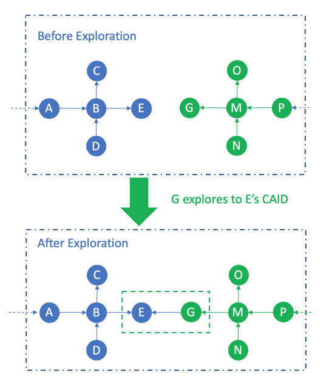

# Dandelion Network 2.0

## 1. Conception

Dandelion Network is a real relationship of human society. built-up by graph theory in mathematics , every single person is simply  abstracted as a node in Dandelion Network.every relationship between two persons is simply abstracted as a path in Dandelion Network.

# 2.Characteristic

### 2.1 Directionless

The relationship of human being is directionless,like that Alice is a friend of Bob , Bob is a friend of Alice at the same time .Like human society, nodes in Dandelion Network are directionless.Like:

Node A goes to Node B by path 1, Node B goes to Node A by path 1 too. We call the path between A and B is Path 1.

### 2.2 Transitive

In human society. the relationship can be transmit to other relationship. like that Alice is a friend of Bob. Cathy is a friend of David. Once Bob get the relationship of Cathy, the two relationships merged into one big relationship chain.

In case of that. All the relationships in Dandelion Network is transitive and annexable. For Example:

net A is that Node M connects Node N. net B is that Node O Connects Node P.

net C is gererated after that N gets a relationship to O

### 2.3 Shortest-Path-First

sense 1:

Alice is a friend of Bob, Bob is a friend Cathy, Cathy is a friend of David. if Alice wants to get a message from David ,Alice Call Bob,Bob Call Cathy,Cathy Call David.that's the only way.

sense 2:

Alice is a friend of Bob, Bob is a friend Cathy, Cathy is a friend of David. Alice is a friend of David. There are 2 ways if Alice wants to get a message from David:

way 1: Alice Call Bob,Bob Call Cathy,Cathy Call David

way 2: Alice Call David.

In Dandelion Network. we call it Shortest-Path-First .

There are 2 paths between node A and node B. but the real path in Dandelion Network is the shortest one . so the path is one.

## 3.Reward Model 1.0

The Reward Model in Dandelion Network 1.0 is Directionless Relationship Reward Model. it's called DRR.

In DRR.every node can get the rewards equally in path .

## 4. Reward Model 2.0

The Reward Model in Dandelion Network 2.0 is Backward Relationship Reward Model. it's called BRR.

In BRR,only the nodes in the backward relationship of the first node which is due to be rewarded.

### 4.1 Directions

#### 4.1.1 Activation

##### 1. Activation of Two CAIDS

##### 2. Activation of Three CAIDS

#### 4.1.2 Exploration

##### 1. Exploration of Two CAIDS

##### 2. Exploration of Three CAIDS

### 4.2 BRR Model

#### 4.2.1 Activation

A new node  activates the CAID by paying 50 VCC.the 50 VCC is dispatched to 3 parts.

**1.80% is used to sharing to the target net by the backward paths**

**2.10% is used to the fund .8% to the homeless fund.2% to the hermit fund.**

**3.10% is used to be destroyed.**

the detail as followed.

| Payment | Direct CAID\(80%\*60%\) | Backward Paths 1\(80\*25%\) | Backward Paths 2\(80%\*15%\) | Homeless fund\(10\*80%\) | Hermit fund\(10%\*20%\) | Destroyed\(10%\) |
| :---: | :---: | :---: | :---: | :---: | :---: | :---: |
| 50 VCC | 24 VCC | 10 VCC | 6 VCC | 4 VCC | 1 VCC | 5 VCC |

**For Example:**

The reward details are

| Backward Paths | Direct CAID | CAIDs in backward path 1 | CAIDS in backward path 2 |
| :--- | :--- | :--- | :--- |
| A-&gt;B-&gt;E . D-&gt;B-&gt;E | E | B | A.D |
|  | 50\*80%\*60% = 24 VCC | 50\*80%25%=10VCC | A:50\*80%\*15%\*50%=3VCC.D:50\*80%\*15%\*50%=3VCC |

#### 4.2.2 Exploration

A node  explores to another CAID by paying 50 VCC.the 50 VCC is dispatched to 4 parts.

**1.40% is used to sharing the explorer's net by the backward paths**

**1.40% is used to sharing the exploring-target's net by the backward paths**

**2.10% is used to the fund .8% to the homeless fund.2% to the hermit fund.**

**3.10% is used to be destroyed.**

The details are as following.

| Payment | Explorer's net sharing\(40%\) | Exploring-target's net sharing\(40%\) | Homeless fund\(10%\*80%\) | Hermit fund\(10%\*20%\) | Destroyed\(10%\) |
| :--- | :---: | :---: | :---: | :---: | :---: |
| 50 VCC | 20 VCC | 20 VCC | 4 VCC | 1 VCC | 5 VCC |

The explorer's net rewards shares like this

| Explorer's net reward total | Explorer \(0\) | CAIDs in explorer's backward path 1\(60%\) | CAIDs in explorer's backward path 2\(40%\) |
| :--- | :--- | :--- | :--- |
| 20 VCC | 0 | 20VCC \* 60% = 12 VCC | 20VCC \* 40% = 8 VCC |

The explorer-target's net rewards shares like this

| Exploring-target's net reward total | Exploring-target\(60%\) | CAIDs in explorer's backward path 1\(25%\) | CAIDs in explorer's backward path 2\(15%\) |
| :--- | :--- | :--- | :--- |
| 20 VCC | 20VCC \*60% = 12 VCC | 20VCC \* 25% = 5 VCC | 20VCC \* 15% = 3 VCC |

**For Example:**

The explorer's net\(the origin net of G\) rewards are

| Explorer's net reward total | Explorer \(0\) | CAIDs in explorer's backward path 1\(60%\) | CAIDs in explorer's backward path 2\(40%\) |
| :--- | :--- | :--- | :--- |
|  | G | M | P.N |
| 20 VCC | 0 | 20VCC \* 60% = 12 VCC | P:20VCC \* 40%\*50% = 4 VCC.N:20VCC \* 40%\*50% = 4 VCC |

Note:O gets no reward.because C is in the forward relationship of M not backward.

The explorer-target's net \(\(the origin net of E\) rewards are

| Exploring-target's net reward total | Exploring-target\(60%\) | CAIDs in explorer's backward path 1\(25%\) | CAIDs in explorer's backward path 2\(15%\) |
| :--- | :--- | :--- | :--- |
|  | E | B | A.D |
| 20 VCC | 20VCC \*60% = 12 VCC | 20VCC \* 25% = 5 VCC | A:20VCC \* 15%\*50% = 1.5 VCC. B:20VCC \* 15%\*50% = 1.5 VCC |

Note:C gets no reward.because C is in the forward relationship of B not backward.

